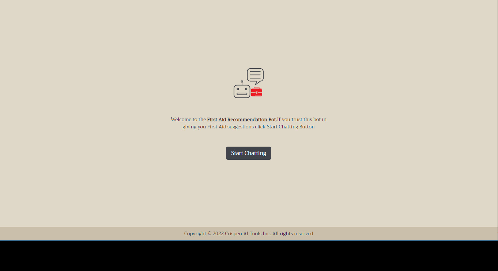
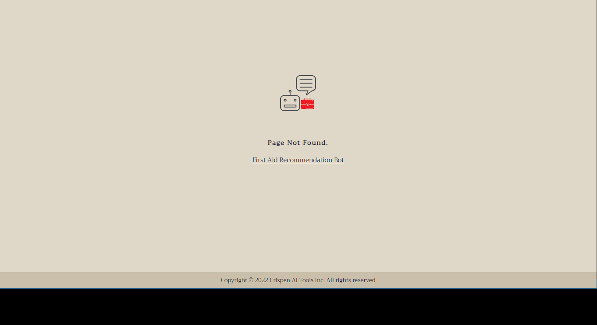
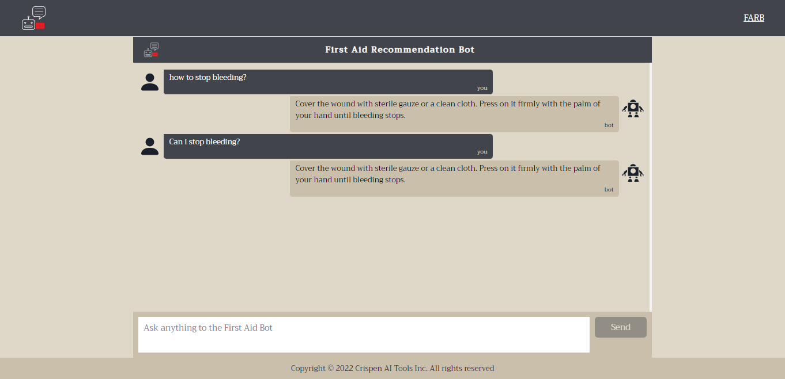

### First Aid Recommendation Bot (FARB)

`FARB` is a simple machine learning graphql and rest API build to do basic virtual assistance in first aid treatments. So I present the `FARB` that helps human in recommending the first aid treatments.

<p align="center">

<p>

`First Aid Recommendation Bot (FARB)` is an BOT API for recommending `First Aid Treatments` to human beings.

<p align="center">

<p>

### FARB Tool

`FARB` tools were built for both mobile applications and web applications using `react-native` and `next.js` respectively.

1. mobile

<p align="center">


<p>

2. web

<p align="center">



<p>

### API

`FARB` api is a simple rest api that is served at `http://localhost:3001/api/v1/ask` and is able to predict tags in the message and give you better recommendations for your `First Aid Treatment`.

### API response

If a proper `POST` request is sent to the server at `http://localhost:3001/api/v1/ask` we will be able to get `~99.11%` accurate predictions of tags from the `farb` bot model and with the correct request body you will be able to get the predictions of the `tag` together with the `recommendations` from the bot on your `First Aid` query.

### Rest request

Rest API is exposed at `http://localhost:3001/api/v1/ask` using the `POST` method only. So you can use any client such as:

1. Thunder Client
2. Postman
3. cURL
4. Axios (javascript)
5. Fetch API (javascript)
6. etc

To make a post request to the server at `http://localhost:3001/api/v1/ask` with a json body that looks as follows:

```json
{
  "message": "What to do if I have splinters?"
}
```

The server will respond with the `API` response which looks as follows:

```json
{
  "prediction": {
    "confidence": 1.0,
    "pattern": "what to do if i have splinters?",
    "tag": "splinter",
    "tagId": 10
  },
  "response": {
    "message": "1. SOAK IT IN EPSOM SALTS. Dissolve a cup of the salts into a warm bath and soak whatever part of the body has the splinter. Failing that, you can also put some of the salts onto a bandage pad and leave it covered for a day; this will eventually help bring the splinter to the surface. 2. VINEGAR OR OIL. Another simple way to draw out that stubborn splinter is to soak the affected area in oil (olive or corn) or white vinegar. Just pour some in a bowl and soak the area for around 20 to 30 minutes,"
  },
  "success": true
}
```

### GraphQL endpoint

GraphQL endpoint is served at `http://localhost:3001/graphql` sending a graphql request at this endpoint that looks as follows:

```
fragment ErrorFragment on Error {
  field
  message
}
fragment BotResponseFragment on BotResponse {
  message
}
fragment BotPredictionFragement on BotPrediction {
  confidence
  tag
  tagId
  pattern
}

fragment AskBotResponse on AskBotResponse {
  error {
    ...ErrorFragment
  }
  success
  response {
    ...BotResponseFragment
  }
  prediction {
    ...BotPredictionFragement
  }
}
mutation AskBot($input: AskBotInput!) {
  askBot(input: $input) {
    ...AskBotResponse
  }
}

```

With the following variables:

```json
{
  "input": {
    "message": "What to do if I have splinters?"
  }
}
```

Will yield the results that looks as follows:

```json
{
  "data": {
    "askBot": {
      "error": null,
      "prediction": {
        "confidence": 1,
        "pattern": "what to do if i have splinters?",
        "tag": "splinter",
        "tagId": 10
      },
      "response": {
        "message": "1. SOAK IT IN EPSOM SALTS. Dissolve a cup of the salts into a warm bath and soak whatever part of the body has the splinter. Failing that, you can also put some of the salts onto a bandage pad and leave it covered for a day; this will eventually help bring the splinter to the surface. 2. VINEGAR OR OIL. Another simple way to draw out that stubborn splinter is to soak the affected area in oil (olive or corn) or white vinegar. Just pour some in a bowl and soak the area for around 20 to 30 minutes,"
      },
      "success": true
    }
  }
}
```

### Languages

In this project the following languages was used:

```shell
- typescript(javascript)
- python
```

### Notebooks

The notebooks for training the model that is being used to intents classification wan be found [here](https://github.com/CrispenGari/nlp-pytorch/blob/main/09_FIRST_AID_RECOMENTATION_BOT/01_FIRST_AID_RECOMENTATION_BOT.ipynb).

### intents.json

This file also contain responses for the `Bot`. Not that from the original dataset from `kaggle` this file was missing responses for other tags so i went ehead and fill that up and you can find the final `intents.json` file in the `server/api/models/static` folder.

### License

In this simple AI tool i'm using `MIT` license which read as follows:

```shell
MIT License

Copyright (c) 2022 crispengari

Permission is hereby granted, free of charge, to any person obtaining a copy
of this software and associated documentation files (the "Software"), to deal
in the Software without restriction, including without limitation the rights
to use, copy, modify, merge, publish, distribute, sublicense, and/or sell
copies of the Software, and to permit persons to whom the Software is
furnished to do so, subject to the following conditions:

The above copyright notice and this permission notice shall be included in all
copies or substantial portions of the Software.

THE SOFTWARE IS PROVIDED "AS IS", WITHOUT WARRANTY OF ANY KIND, EXPRESS OR
IMPLIED, INCLUDING BUT NOT LIMITED TO THE WARRANTIES OF MERCHANTABILITY,
FITNESS FOR A PARTICULAR PURPOSE AND NONINFRINGEMENT. IN NO EVENT SHALL THE
AUTHORS OR COPYRIGHT HOLDERS BE LIABLE FOR ANY CLAIM, DAMAGES OR OTHER
LIABILITY, WHETHER IN AN ACTION OF CONTRACT, TORT OR OTHERWISE, ARISING FROM,
OUT OF OR IN CONNECTION WITH THE SOFTWARE OR THE USE OR OTHER DEALINGS IN THE
SOFTWARE.
```
